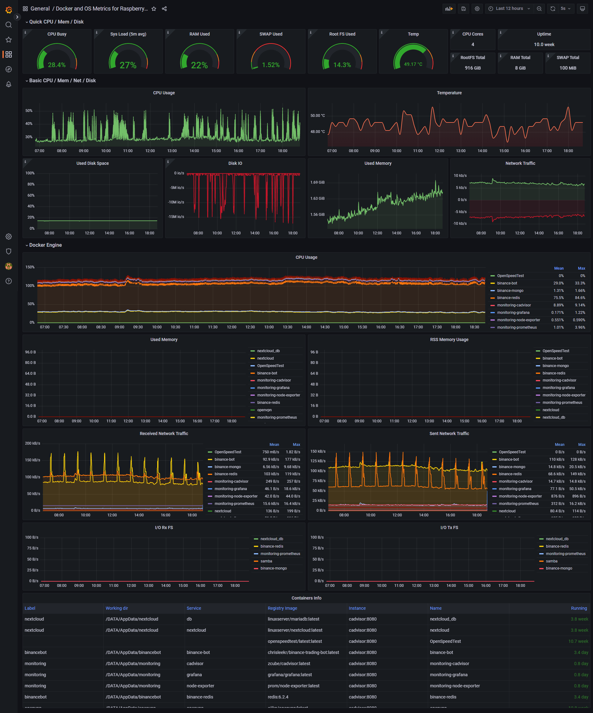

# Raspberry Pi & Docker Monitoring

## Hit the Star! :star:

If you find this repository useful, please consider giving it a star. Your support is greatly appreciated! :pray:

## Introduction

Introducing the Raspberry Pi monitoring solution using Grafana, Prometheus, Cadvisor, and Node-Exporter Stack! This project aims to provide a comprehensive and user-friendly way to monitor the performance of your Raspberry Pi. With Grafana's intuitive dashboards, you can easily visualize system metrics collected by Prometheus and Cadvisor, while Node-Exporter provides valuable information about the Raspberry Pi's hardware and operating system. The combination of these tools results in a powerful and efficient monitoring solution that will give you complete visibility into your system's health. Check out the project and take your Raspberry Pi monitoring to the next level !

This repository contains a `docker-compose` file to run a Raspberry PI monitoring stack. It is based on the following projects:
- [Prometheus](https://prometheus.io/)
- [Grafana](http://grafana.org/)
- [cAdvisor](https://github.com/google/cadvisor)
- [NodeExporter](https://github.com/prometheus/node_exporter)

## Prerequisites

Before we get started installing the stack, we need to make sure that the following prerequisites are met:
- Docker is installed on the host machine
- Docker Compose is installed on the host machine
- The host machine is running a Raspberry PI OS or any other compatible Linux distribution

## Installation and Configuration

To install the stack, follow the steps below:

- Clone this repository to your host machine.
```bash
git clone https://github.com/oijkn/Docker-Raspberry-PI-Monitoring.git
```

- Enter to the cloned directory.
```bash
cd Docker-Raspberry-PI-Monitoring
```

 - Create `data` directory and change the ownership of the `prometheus` and `grafana` folders for a nice and clean installation.
```bash
mkdir -p prometheus/data grafana/data && \
sudo chown -R 472:472 grafana/ && \
sudo chown -R 65534:65534 prometheus/
```

 - Start the stack with `docker-compose`.
```bash
docker-compose up -d
```

This will start all the containers and make them available on the host machine.
<br/>The following ports are used (only Grafana is exposed on the host machine):
- 3000: Grafana
- 9090: Prometheus
- 8080: cAdvisor
- 9100: NodeExporter

The Grafana dashboard can be accessed by navigating to `http://<host-ip>:3000` in your browser for example `http://192.168.1.100:3000`.
<br/>The default username and password are both `admin`. You will be prompted to change the password on the first login.
<br/>Credentials can be changed by editing the [.env](grafana/.env) file.

If you would like to change which targets should be monitored, you can edit the [prometheus.yml](prometheus/prometheus.yml) file.
<br/>The targets section contains a list of all the targets that should be monitored by Prometheus.
<br/>The names defined in the `job_name` section are used to identify the targets in Grafana.
<br/>The `static_configs` section contains the IP addresses of the targets that should be monitored. Actually, they are sourced from the service names defined in the [docker-compose.yml](docker-compose.yml) file.
<br/>If you think that the `scrape_interval` value is too aggressive, you can change it to a more suitable value.

In order to check if the stack is running correctly, you can run the following command:
```bash
docker-compose ps
```

View the logs of a specific container by running the following command:
```bash
docker logs -f <container-name>
```

## Add Data Sources and Dashboards

Since Grafana v5 has introduced the concept of provisioning, it is possible to automatically add data sources and dashboards to Grafana.
<br/>This is done by placing the `datasources` and `dashboards` directories in the [provisioning](grafana/provisioning) folder. The files in these directories are automatically loaded by Grafana on startup.

If you like to add a new dashboard, simply place the JSON file in the [dashboards](grafana/provisioning/dashboards) directory, and it will be automatically loaded next time Grafana is started.

# Install Dashboard from Grafana.com (Optional)

If you would like to install this dashboard from Grafana.com, simply follow the steps below:
- Navigate to the dashboard on [Grafana.com Dashboard](https://grafana.com/grafana/dashboards/15120-raspberry-pi-docker-monitoring/)
- Click on the `Copy ID to Clipboard` button
- Navigate to the `Import` page in Grafana
- Paste the ID into the `Import via grafana.com` field
- Click on the `Load` button
- Click on the `Import` button

Or you can follow the steps described in the [Grafana Documentation](https://grafana.com/docs/grafana/latest/dashboards/manage-dashboards/#import-a-dashboard).

This dashboard is intended to help you get started with monitoring your Raspberry PI devices. If you have any changes or suggestions, you would like to see, please feel free to open an issue or create a pull request.

Here is a screenshot of the dashboard:


## License

This project is licensed under the MIT License - see the [LICENSE](LICENSE) file for details

## Troubleshooting

Enable `c-group` memory and swap accounting on the host machine by running the following command:
```bash
sudo sed -i 's/^GRUB_CMDLINE_LINUX=""/GRUB_CMDLINE_LINUX="cgroup_enable=memory cgroup_memory=1 swapaccount=1"/' /etc/default/grub
sudo update-grub
sudo reboot
```
